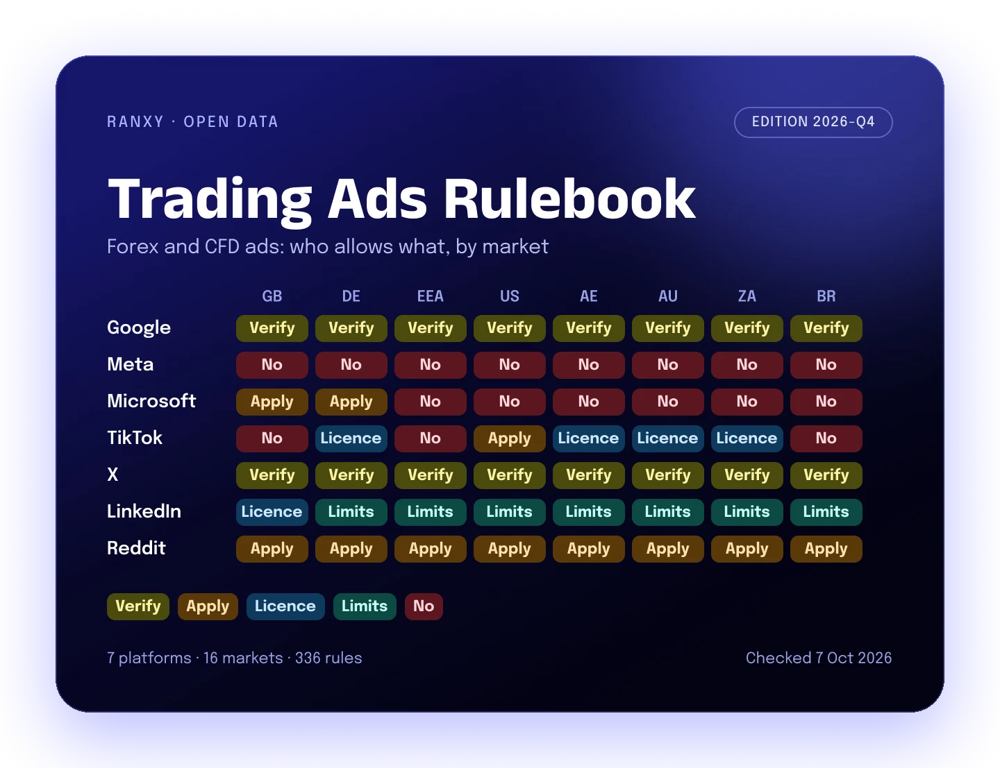

# Trading Ads Rulebook, edition 2026-Q4

 

Can a forex broker, a crypto exchange or a prop firm run ads on Google, Meta, Microsoft, TikTok, X, LinkedIn or Reddit? And what does it need first? This dataset answers that for 16 markets, with a quote from each platform's own policy page.

Published by [Ranxy](https://ranxy.com/). Free to use under CC BY 4.0.

## What is inside

| File | What it holds |
|---|---|
| `trading-ads-rulebook-2026-Q4.csv` | 336 rows: 7 platforms x 3 products x 16 markets |
| `trading-ads-rulebook-changes-2026-Q4.csv` | 56 dated policy changes from January 2025 to October 2026 |
| `data-dictionary.csv` | Every field, explained |
| `datapackage.json` | Machine readable description (Frictionless Data) |

Products: forex and CFD brokers, crypto exchanges and wallets, prop trading firms that sell funded challenges.

Markets: United Arab Emirates, Australia, Brazil, Germany, United Kingdom, Kenya, Mexico, Malaysia, Nigeria, Philippines, Thailand, United States, Vietnam, South Africa, other EEA countries, and the rest of the world.

## Status words

Each row has one status. It is the strictest gate that applies.

| Status | Meaning | Rows |
|---|---|---|
| not_allowed | The platform bans these ads here | 59 |
| written_permission_needed | You must apply and get a yes from the platform first | 63 |
| verification_needed | You must pass the platform's advertiser verification or certification | 49 |
| licence_needed | You must hold a local licence; no separate platform form is named | 14 |
| restricted | Allowed with limits, such as age or format | 30 |
| no_specific_rule | The platform does not name this product; general finance rules apply | 121 |

## Quick view: markets where ads are possible at all

| Platform | Forex and CFD | Crypto | Prop firms |
|---|---|---|---|
| Google Ads | 10 of 16 | 8 of 16 | not named |
| Meta | 0 of 16 | 16 of 16 | not named |
| Microsoft Advertising | 2 of 16 | 6 of 16 | not named |
| TikTok | 12 of 16 | 16 of 16 | not named |
| X | 15 of 16 | 16 of 16 | not named |
| LinkedIn | 16 of 16 | 16 of 16 | not named |
| Reddit | 16 of 16 | 16 of 16 | not named |

"Possible" means not banned. Most markets still need a licence, verification or written permission.

## How we built it

1. We read each platform's official ad policy pages. Status and quotes come only from those pages.
2. Press reports were used only to find official pages and for some change log rows (marked press).
3. We checked every quote against the live page in a browser on 7 October 2026. LinkedIn quotes are marked manual_check until a person confirms them.
4. Where a page does not name a product, we say no_specific_rule and explain our reading in the notes.

## Limits

- This is not legal advice. Platforms change rules often. Check the policy link before you spend.
- No platform names prop firms. Those rows show the general finance rules that likely apply.
- Some platforms do not publish country lists (for example Reddit). The notes say so.

## Where to get it

- Web page with a searchable table: https://ranxy.com/reports/trading-ads-rulebook/
- Zenodo (DOI): https://doi.org/10.5281/zenodo.23219882
- GitHub: https://github.com/RanxyAgency/trading-ads-rulebook
- Hugging Face: https://huggingface.co/datasets/RanxyAgency/trading-ads-rulebook
- Kaggle: https://www.kaggle.com/datasets/ranxyagency/trading-ads-rulebook
- Internet Archive: https://archive.org/details/ranxy-trading-ads-rulebook-2026-q4

## Cite

Ranxy (2026). Trading Ads Rulebook, edition 2026-Q4. CC BY 4.0. https://doi.org/10.5281/zenodo.23219882

This edition was checked on 7 October 2026. Rules change, so open the policy link in each row before you spend.
